# 🚀 Enterprise Database & Data Platform Installer Suite

<div align="center">


**A comprehensive automation suite for deploying enterprise-grade data platforms**

[🔧 Quick Start](#-quick-start) • [📖 Documentation](#-documentation) • [🏗️ Architecture](#-architecture) • [🛠️ Troubleshooting](#-troubleshooting)

</div>

---

## 🌟 Overview

This installer suite provides **production-ready automation** for deploying complex data platforms on Linux servers. Built with enterprise reliability in mind, it supports single-node and multi-node cluster configurations with comprehensive error handling and recovery capabilities.

### 🎯 Supported Platforms

| Platform | Version | Description | Status |
|----------|---------|-------------|--------|
| 🐘 **Greenplum Database** | 7.5.2 | Massively parallel PostgreSQL-based analytics database | ✅ Production Ready |
| 🔍 **OpenMetadata** | 1.8.0+ | Unified metadata platform for data discovery & governance | ✅ Production Ready |
| 🏗️ **Tanzu Data Lake Controller** | 2.0 | VMware data lake management and orchestration | ✅ Production Ready |

---

## 🏗️ Architecture

```mermaid
graph TB
    subgraph "🎯 Main Installers"
        GP[🐘 gpdb_installer.sh<br/>Greenplum Database]
        OM[🔍 openmetadata_installer.sh<br/>OpenMetadata Platform]
        DL[🏗️ datalake_installer.sh<br/>Data Lake Controller]
    end
    
    subgraph "📚 Library Modules"
        CONFIG[⚙️ config.sh<br/>Configuration Management]
        SSH[🔐 ssh.sh<br/>Secure Communications]
        LOG[📝 logging.sh<br/>Structured Logging]
        VALID[✅ validation.sh<br/>Pre-flight Checks]
        SYS[🖥️ system.sh<br/>OS Operations]
        GPLIB[🐘 greenplum.sh<br/>GP-specific Functions]
        PXF[🔌 pxf.sh<br/>PXF Integration]
        MADLIB[📦 madlib.sh<br/>MADlib Installer]
        POSTGIS[🌍 postgis.sh<br/>PostGIS Installer]
        SPARK[⚡ spark.sh<br/>Spark Connector]
        ERR[🚨 error_handling.sh<br/>Fault Management]
    end
    
    subgraph "🛠️ Build Tools"
        UTILS[scripts/utils/<br/>⚡ Build & Release Tools]
    end
    
    subgraph "📋 Configuration"
        GPCONF[gpdb_config.conf.template<br/>🐘 Greenplum Config]
        OMCONF[openmetadata_config.conf.template<br/>🔍 OpenMetadata Config]
        DLCONF[datalake_config.conf.template<br/>🏗️ Data Lake Config]
    end
    
    GP --> CONFIG
    GP --> SSH
    GP --> LOG
    GP --> GPLIB
    GP --> PXF
    GP --> MADLIB
    GP --> POSTGIS
    GP --> SPARK
    
    OM --> CONFIG
    OM --> SSH
    OM --> LOG
    
    DL --> CONFIG
    DL --> SSH
    DL --> LOG
    
    CONFIG --> VALID
    CONFIG --> SYS
    CONFIG --> ERR
    
    GP -.-> GPCONF
    OM -.-> OMCONF
    DL -.-> DLCONF
    
    style GP fill:#e1f5fe
    style OM fill:#f3e5f5
    style DL fill:#e8f5e8
    style CONFIG fill:#fff3e0
    style SSH fill:#ffebee
    style LOG fill:#f1f8e9
```



---

## 🚀 Quick Start

### 📋 Prerequisites

| Requirement | Details |
|-------------|---------|
| 🖥️ **Operating System** | RHEL/CentOS/Rocky Linux 7/8/9 |
| 👤 **User Access** | Root or sudo privileges |
| 🌐 **Network** | SSH access to all target hosts |
| 💾 **Storage** | Minimum 10GB free space |
| 🧠 **Memory** | 4GB+ RAM (8GB+ recommended) |

### ⚡ Installation Commands

#### 🐘 Greenplum Database
```bash
# 1. Configure your cluster
cp gpdb_config.conf.template gpdb_config.conf
vim gpdb_config.conf

# 2. Deploy Greenplum + PXF
./gpdb_installer.sh

# 3. Optional: Test installation
./gpdb_installer.sh --dry-run
```

#### 🔍 OpenMetadata Platform
```bash
# 1. Configure deployment
cp openmetadata_config.conf.template openmetadata_config.conf
vim openmetadata_config.conf

# 2. Deploy OpenMetadata
./openmetadata_installer.sh

# 3. Access UI at http://your-server:8585
# Default login: admin@open-metadata.org / admin
```

#### 🏗️ Data Lake Controller
```bash
# 1. Configure controller
cp datalake_config.conf.template datalake_config.conf
vim datalake_config.conf

# 2. Deploy controller
./datalake_installer.sh
```

---

## 🎛️ Advanced Features

### 🔄 Lifecycle Management

| Operation | Greenplum | OpenMetadata | Data Lake |
|-----------|-----------|--------------|-----------|
| **Install** | `./gpdb_installer.sh` | `./openmetadata_installer.sh` | `./datalake_installer.sh` |
| **Dry Run** | `--dry-run` | `--dry-run` | `--dry-run` |
| **Clean Install** | `--force` | `--clean` | `--clean` |
| **Uninstall** | `--clean` | `--remove` | `--clean` |
| **Custom Config** | `--config custom.conf` | `--config custom.conf` | `--config custom.conf` |

### 🔧 Configuration Templates

<details>
<summary>🐘 <strong>Greenplum Configuration</strong></summary>

```bash
# Core cluster settings
GPDB_COORDINATOR_HOST="gp-coordinator.example.com"
GPDB_SEGMENT_HOSTS=("gp-seg1.example.com" "gp-seg2.example.com")
GPDB_STANDBY_HOST="gp-standby.example.com"  # Optional

# User credentials
SSH_USER="gpadmin"
SUDO_PASSWORD="your_sudo_password"

# Installation options
INSTALL_PXF=true
CREATE_SAMPLE_DATABASE=true
DATABASE_NAME="analytics"
```
</details>

<details>
<summary>🔍 <strong>OpenMetadata Configuration</strong></summary>

```bash
# Target deployment
REMOTE_HOST="metadata.example.com"
REMOTE_USER="ubuntu"

# Service configuration
OPENMETADATA_VERSION="latest"
OPENMETADATA_INGESTION_PORT=8082

# Admin credentials
OPENMETADATA_ADMIN_USER="admin@open-metadata.org"
OPENMETADATA_ADMIN_PASSWORD="admin"

# Storage paths
OPENMETADATA_DATA_DIR="/opt/openmetadata/data"
OPENMETADATA_LOGS_DIR="/opt/openmetadata/logs"
```
</details>

<details>
<summary>🏗️ <strong>Data Lake Configuration</strong></summary>

```bash
# Controller deployment
TDL_HOST="datalake.example.com"
TDL_USER="tdl-admin"

# Service settings
TDL_CONTROLLER_PORT=8080
TDL_API_PORT=8081

# Storage configuration
TDL_DATA_PATH="/opt/tdl/data"
TDL_LOG_PATH="/opt/tdl/logs"
```
</details>

---

## 🧩 Component Integration

### 🔌 PXF (Platform Extension Framework)

The Greenplum installer includes **automatic PXF setup** with intelligent configuration management:

- ✅ **Auto-detection** of Java environments
- ✅ **Cluster registration** with Greenplum
- ✅ **Extension installation** across all databases
- ✅ **Configuration validation** and auto-repair
- ✅ **HDFS/S3/JDBC connectivity** ready

**PXF Configuration Fix Integration:**
```bash
# Automatically handles common PXF issues:
# ❌ "pxf.pxf_base parameter cannot be empty"
# ❌ Missing PXF extensions
# ❌ Java environment issues
# ✅ All fixed automatically during installation!
```

### 🐳 Docker Integration

OpenMetadata installer provides **enterprise Docker management**:

- 🔄 **Automatic Docker installation** (if missing)
- 🔧 **Docker Compose orchestration** with official configurations
- 📊 **Service health monitoring** and auto-recovery
- 🔒 **Firewall configuration** for secure access
- 📈 **Resource optimization** for production workloads

---

## 📊 Project Structure

```
📁 gpdb_installer/
├── 🎯 Main Installers
│   ├── 🐘 gpdb_installer.sh          # Greenplum Database installer
│   ├── 🔍 openmetadata_installer.sh   # OpenMetadata platform installer
│   └── 🏗️ datalake_installer.sh       # Data Lake Controller installer
│
├── 📚 Core Libraries (/lib)
│   ├── ⚙️ config.sh                   # Configuration management
│   ├── 🔐 ssh.sh                      # SSH operations & multiplexing
│   ├── 📝 logging.sh                  # Structured logging system
│   ├── ✅ validation.sh               # Pre-flight validation
│   ├── 🖥️ system.sh                   # OS-specific operations
│   ├── 🐘 greenplum.sh                # Greenplum-specific functions
│   ├── 🔌 pxf.sh                      # PXF integration & fixes
│   └── 🚨 error_handling.sh           # Error management & recovery
│
├── 🛠️ Build & Deployment (/scripts)
│   └── utils/                         # Package creation & release tools
│
├── 📋 Configuration Templates
│   ├── 🐘 gpdb_config.conf.template
│   ├── 🔍 openmetadata_config.conf.template
│   └── 🏗️ datalake_config.conf.template
│
├── 📖 Documentation (/docs)
│   ├── 🏗️ ARCHITECTURE.md             # System architecture
│   ├── 🛠️ TROUBLESHOOTING.md          # Issue resolution
│   ├── 🧪 TESTING_SUMMARY.md          # Test procedures
│   └── 📚 Additional guides...
│
└── 📦 Installation Assets (/files)
    ├── 🐘 greenplum-db-*.rpm
    ├── 🔌 pxf-gp7-*.rpm
    └── 🏗️ tdl-controller-*.rpm
```

---

## 🧪 Testing & Validation

### 🔍 Pre-flight Checks

All installers perform comprehensive validation:

| Check Category | Validation Items |
|----------------|------------------|
| 🖥️ **System Resources** | CPU, Memory, Disk Space, OS Version |
| 🌐 **Network Connectivity** | SSH access, DNS resolution, Port availability |
| 📦 **Dependencies** | Required packages, Java (for PXF), Docker (for OpenMetadata) |
| 🔐 **Security** | User permissions, Firewall rules, SELinux status |
| 📁 **File System** | Mount points, Permissions, Available space |

### 🧪 Test Suites

```bash
# Run comprehensive tests
./scripts/tests/run_all_tests.sh

# Individual test categories
./scripts/tests/test_config.sh          # Configuration parsing
./scripts/tests/test_ssh.sh             # SSH connectivity
./scripts/tests/test_validation.sh      # System validation
```

---

## 🛠️ Troubleshooting

### 🚨 Common Issues & Solutions

<details>
<summary>🔧 <strong>SSH Connection Issues</strong></summary>

**Problem:** Multiple password prompts or connection failures
```bash
# Solution: Enable SSH connection multiplexing (automatic in v2.0+)
# Manual fix:
ssh-keygen -t rsa -b 4096
ssh-copy-id user@target-host
```
</details>

<details>
<summary>🐘 <strong>Greenplum Cluster Issues</strong></summary>

**Problem:** Segment initialization failures
```bash
# Check system resources
./gpdb_installer.sh --dry-run

# Clean install
./gpdb_installer.sh --clean
./gpdb_installer.sh --force
```
</details>

<details>
<summary>🔌 <strong>PXF Configuration Issues</strong></summary>

**Problem:** "pxf.pxf_base parameter cannot be empty"
```bash
# ✅ Automatically fixed in v2.0+!
# The installer now includes integrated PXF configuration validation
# No manual intervention required
```
</details>

<details>
<summary>🔍 <strong>OpenMetadata Service Issues</strong></summary>

**Problem:** Services won't start or UI inaccessible
```bash
# Check service status
./openmetadata_installer.sh --dry-run

# Clean reinstall
./openmetadata_installer.sh --clean
./openmetadata_installer.sh
```
</details>

### 📞 Getting Help

| Resource | Location |
|----------|----------|
| 🏗️ **Architecture Guide** | [`docs/ARCHITECTURE.md`](docs/ARCHITECTURE.md) |
| 🛠️ **Troubleshooting** | [`docs/TROUBLESHOOTING.md`](docs/TROUBLESHOOTING.md) |
| 🧪 **Testing Guide** | [`docs/TESTING_SUMMARY.md`](docs/TESTING_SUMMARY.md) |
| 👨‍💻 **Development** | [`docs/DEVELOPER_GUIDE.md`](docs/DEVELOPER_GUIDE.md) |

---

## 🚀 Advanced Usage

### 🔄 CI/CD Integration

```bash
# Automated deployment pipeline
./scripts/utils/package.sh --release    # Create GitHub release
./gpdb_installer.sh --dry-run          # Validate configuration
./gpdb_installer.sh                    # Deploy to production
```

### 🐳 Container Integration

```bash
# OpenMetadata with custom Docker settings
export DOCKER_COMPOSE_PROFILES="ingestion,elasticsearch"
./openmetadata_installer.sh --config production.conf
```

### 📊 Monitoring Integration

```bash
# Enable comprehensive logging
export LOG_LEVEL=DEBUG
export LOG_FILE="/var/log/installer.log"
./gpdb_installer.sh
```

---

## 🤝 Contributing

We welcome contributions! Please see our [Development Guide](docs/DEVELOPER_GUIDE.md) for details.

### 🔧 Development Setup

```bash
# Clone repository
git clone https://github.com/your-org/gpdb_installer.git
cd gpdb_installer

# Run tests
./scripts/tests/run_all_tests.sh

# Create feature branch
git checkout -b feature/your-feature
```

---

## 📈 Roadmap

| Version | Features | Status |
|---------|----------|--------|
| **v2.0** | Integrated PXF fixes, reorganized architecture | ✅ **Current** |
| **v2.1** | Kubernetes deployment support | 🔄 **In Progress** |
| **v2.2** | Multi-cloud provider support | 📋 **Planned** |
| **v3.0** | Web-based management interface | 💭 **Future** |

---

## 📄 License

This project is licensed under the MIT License - see the [LICENSE](LICENSE) file for details.

---

<div align="center">

**🌟 Star this repository if it helps you!**

Made with ❤️ for the data community

[⬆️ Back to Top](#-enterprise-database--data-platform-installer-suite)

</div>
